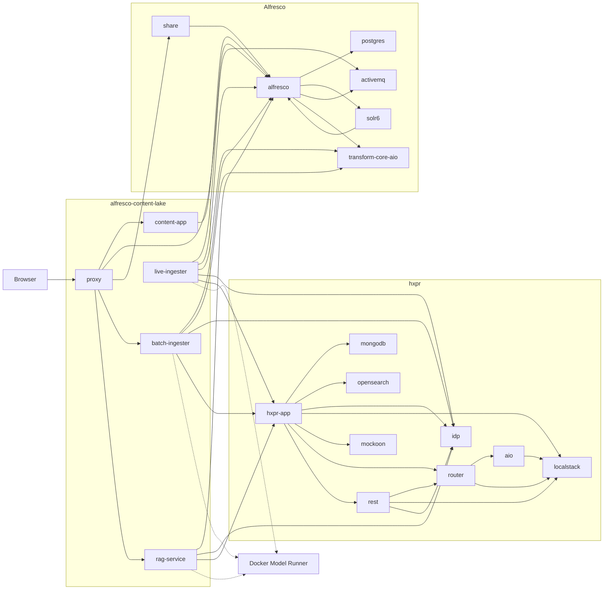

# Alfresco Content Lake Deploy

[](LICENSE)
[](https://openjdk.org/projects/jdk/21/)
[](https://spring.io/projects/spring-boot)
[](https://maven.apache.org/)
[](https://docs.docker.com/compose/)
[]()

Self-contained deployment for Alfresco Content Lake.

The target workflow is:

```bash
git clone https://github.com/aborroy/alfresco-content-lake-deployment.git
cd alfresco-content-lake-deployment
docker login ghcr.io
docker compose up --build
```

No sibling `alfresco/`, `hxpr/`, `alfresco-content-lake/`, or ACA checkout is required.

## Compose Layout

The root entrypoint is [compose.yaml](compose.yaml), which uses Docker Compose `include` to pull in:

- [compose.alfresco.yaml](compose.alfresco.yaml)
- [compose.hxpr.yaml](compose.hxpr.yaml)
- [compose.rag.yaml](compose.rag.yaml)

Shared project name, network, and named volumes stay in the root file.

## Service Topology



Notes:

- `proxy` is the only public entrypoint for Alfresco, Share, the UI, batch APIs, and RAG APIs.
- `opensearch-dashboards` is published separately on port `5601`, not through `proxy`.
- Docker Model Runner is an external dependency used by the Content Lake services, not a Compose service in this repository.

## What Had To Stay From The Alfresco Side

Before redesigning the deployment, the non-negotiable Alfresco-side requirements were:

- Alfresco Repository with the `content-lake-repo-model` module so `cl:indexed` and `cl:excludeFromLake` exist.
- ActiveMQ configured for Alfresco Event2 so `live-ingester` can consume `alfresco.repo.event2`.
- Alfresco Transform Core AIO for text extraction during ingestion.
- Alfresco Search Services / Solr wired with `secureComms=secret`.
- A reverse proxy exposing `/`, `/alfresco/`, `/share/`, `/api-explorer/`, `/api/rag/`, and `/solr/`.

This repo now vendors the required ACS module/config pieces locally and builds the rest of the stack around them.

## What This Repo Provides

- Local ACS repository image customization under `acs/alfresco`
- Vendored HXPR bootstrap assets under `hxpr/`
- Local HXPR Docker build that clones and compiles the requested HXPR branch
- Remote builds for:
  - `aborroy/alfresco-content-lake`
  - `aborroy/alfresco-content-lake-ui`
- Docker Compose orchestration for the full stack
- A split Compose structure using the `include` directive

## GitHub Projects Used

These are the GitHub projects directly used by this deployment:

- [`aborroy/alfresco-content-lake-deployment`](https://github.com/aborroy/alfresco-content-lake-deployment)
  This repository. It contains the Compose files, ACS customization, HXPR build wrapper, proxy config, and deployment documentation.

- [`aborroy/alfresco-content-lake`](https://github.com/aborroy/alfresco-content-lake)
  Used as the remote BuildKit context for:
  `batch-ingester`, `live-ingester`, `rag-service`, and the `content-lake-repo-model` JAR injected into the Alfresco repository image.

- [`aborroy/alfresco-content-lake-ui`](https://github.com/aborroy/alfresco-content-lake-ui)
  Used as the remote BuildKit context for the `content-app` UI image.

- [`HylandSoftware/hxpr`](https://github.com/HylandSoftware/hxpr)
  Cloned during the local HXPR image build to produce the `hxpr-app` service.
  The branch/ref is controlled by `HXPR_GIT_REF` and `HXPR_GIT_SHA`.

- [`HylandSoftware/hxp-transform-service`](https://github.com/HylandSoftware/hxp-transform-service)
  Not cloned directly by Compose, but used through GitHub Packages at
  `https://maven.pkg.github.com/HylandSoftware/hxp-transform-service`
  as an authenticated Maven dependency source during the HXPR build.

## Prerequisites

- Docker Desktop with Docker Compose v2
- Docker Model Runner — enable it in Docker Desktop settings, or install `docker-model-plugin` on Linux
- Access to `ghcr.io` for Hyland images
- Outbound access to GitHub so BuildKit can fetch the remote source contexts
- HXPR build credentials:
  - `MAVEN_USERNAME`
  - `MAVEN_PASSWORD`
  - `NEXUS_USERNAME`
  - `NEXUS_PASSWORD`
- `HXPR_GIT_AUTH_TOKEN` if the HXPR repository cannot be cloned anonymously

## Getting Credentials

The HXPR build uses two authenticated artifact sources:

- GitHub Packages: `https://maven.pkg.github.com/HylandSoftware/hxp-transform-service`
- Hyland Nexus releases: `https://artifacts.alfresco.com/nexus/content/repositories/hylandsoftware-releases`

Use the following values:

- `MAVEN_USERNAME`
  Use your GitHub username.

- `MAVEN_PASSWORD`
  Create a GitHub personal access token from [GitHub token settings](https://github.com/settings/tokens).
  For GitHub Packages, the most compatible option is a classic token from [Generate new token (classic)](https://github.com/settings/tokens/new) with at least `read:packages`.
  If the Hyland package is private in your organization, your GitHub account must also already have read access to that package/repository, and you may need to authorize the token for SSO if GitHub prompts you.

- `NEXUS_USERNAME`
  Use the username for your account on [Hyland Nexus](https://artifacts.alfresco.com/nexus/).
  There is no self-service credential flow documented in this repo for that private repository, so if you do not already have access, request it from the Hyland/Alfresco team that provided your HXPR build access.

- `NEXUS_PASSWORD`
  Use the password paired with your [Hyland Nexus](https://artifacts.alfresco.com/nexus/) account.
  If you cannot sign in there, treat that as an access issue and request/reset the credentials through the Hyland/Alfresco team that manages your access.

- `HXPR_GIT_AUTH_TOKEN`
  This is only needed if `https://github.com/HylandSoftware/hxpr.git` is not cloneable anonymously for your account.
  The simplest option is a GitHub token from [GitHub token settings](https://github.com/settings/tokens):
  use either a classic token with `repo`, or a fine-grained token from [Fine-grained personal access tokens](https://github.com/settings/personal-access-tokens/new) scoped to the `HylandSoftware/hxpr` repository with read access to repository contents.
  If your organization enforces SSO or approval, complete that step in GitHub before using the token.

## First Run

1. Authenticate to GitHub Container Registry:

   ```bash
   docker login ghcr.io
   ```

2. Enable Docker Model Runner in Docker Desktop.

3. Export the HXPR build credentials:

   ```bash
   export MAVEN_USERNAME=...
   export MAVEN_PASSWORD=...
   export NEXUS_USERNAME=...
   export NEXUS_PASSWORD=...
   # optional if needed for the HXPR git clone
   export HXPR_GIT_AUTH_TOKEN=...
   ```

4. Pull the models once:

   ```bash
   docker model pull ai/mxbai-embed-large
   docker model pull ai/qwen2.5
   ```

5. Start the stack:

   ```bash
   docker compose up --build
   ```

Once healthy, open [http://localhost](http://localhost).

## Public Endpoints

Only the proxy is published on the host, on port `80`.

- `http://localhost/` - ACA-based Content Lake UI
- `http://localhost/alfresco/` - Alfresco Repository
- `http://localhost/share/` - Alfresco Share
- `http://localhost/admin/` - Alfresco Control Center
- `http://localhost/api-explorer/` - API Explorer
- `http://localhost/api/rag/` - RAG service
- `http://localhost:5601/` - OpenSearch Dashboards

## Configuration

Defaults live in `.env`. To override values locally, create a `.env.local` file
containing only the variables you want to change:

```bash
# Example .env.local
HXPR_GIT_REF=main
PUBLIC_PORT=9090
```

`.env.local` is listed in `.gitignore` and is never committed.

> **Important:** Docker Compose only auto-loads `.env`. The Makefile passes
> `--env-file .env.local` automatically when the file exists. If you run
> `docker compose` directly, add the flag yourself:
>
> ```bash
> docker compose --env-file .env.local up --build
> ```

The most important overrides are:

- `HXPR_GIT_URL` — defaults to `https://github.com/HylandSoftware/hxpr.git`.
- `HXPR_GIT_REF` — defaults to `feature/CIN-1509-CreateEmbeddingAPI`.
- `HXPR_GIT_SHA` — pin to a specific commit SHA for reproducible builds (empty by default).
- `HXPR_LOCAL_IMAGE` — local image tag used for the built HXPR app.
- `CONTENT_LAKE_GIT_CONTEXT` — defaults to `https://github.com/aborroy/alfresco-content-lake.git#main`.
- `CONTENT_LAKE_UI_GIT_CONTEXT` — defaults to `https://github.com/aborroy/alfresco-content-lake-ui.git#main`.
- `ACA_TAG` — defaults to `7.3.0`.
- `PUBLIC_PORT` — defaults to `80`.
- `MODEL_RUNNER_URL`, `EMBEDDING_MODEL`, `LLM_MODEL` — control the LLM inference backend.
  The default points to Docker Model Runner (`http://model-runner.docker.internal`).
  Spring AI appends `/v1/...` itself. On Linux, override to `http://host.docker.internal:12434` in `.env.local`.

## Day-To-Day Commands

```bash
make up       # build and start (auto-loads .env.local if present)
make down     # stop and remove containers
make logs     # follow logs for all services
make ps       # show running services
make config   # render the resolved compose configuration
```

You can also use `docker compose` directly; remember to add `--env-file .env.local` if you have local overrides.

## Deploying to AWS EC2

See [DEPLOY_EC2.md](DEPLOY_EC2.md) for a step-by-step guide to running the full stack on an `r6i.xlarge` (4 vCPU / 32 GB RAM) Ubuntu instance, including Docker Engine and Docker Model Runner installation, and cost-saving tips.

## Notes

- The HXPR app is now built from source during `docker compose up --build`, using the `feature/CIN-1509-CreateEmbeddingAPI` branch by default.
- HXPR source build requires both GitHub Packages credentials and Hyland Nexus credentials. Those are passed into the build as Compose build secrets sourced from environment variables.
- The Content Lake services still build from source, but Docker now fetches that source itself from GitHub during `docker compose up --build`.
- The repository model is injected directly into the Alfresco image from this repo, so the scope model no longer depends on a second checkout.
- Share and Search Services now use the stock Alfresco images directly rather than local wrapper Dockerfiles.
- The UI is built from `alfresco-content-lake-ui`, which already knows how to layer the RAG extension onto ACA.
- HXPR, OpenSearch, MongoDB, LocalStack, Transform services, and the ingesters are internal-only. OpenSearch Dashboards remains published on `5601`.

## Known Assumption

This repo currently assumes the HXPR branch `feature/CIN-1509-CreateEmbeddingAPI` can be built with the credentials you provide for GitHub Packages and Hyland Nexus. If you need a different HXPR branch or repo URL, override `HXPR_GIT_URL` and `HXPR_GIT_REF`.
