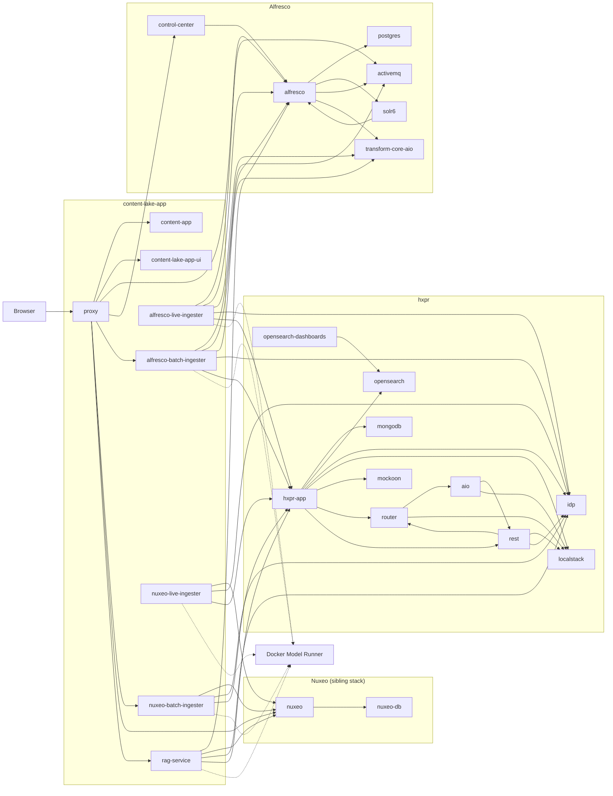

# Content Lake App Deployment

[](LICENSE)
[](https://openjdk.org/projects/jdk/21/)
[](https://spring.io/projects/spring-boot)
[](https://maven.apache.org/)
[](https://docs.docker.com/compose/)
[]()

Self-contained deployment for Content Lake App -- ingests content from Alfresco and Nuxeo into hxpr for hybrid semantic search and RAG.

## Content Lake Ecosystem

Part of the **Content Lake** ecosystem -- a PoC for ingesting Alfresco and Nuxeo content into [hxpr](https://github.com/HylandSoftware/hxpr) for hybrid semantic search and RAG.

| Repo | Role |
|---|---|
| [content-lake-app](https://github.com/aborroy/content-lake-app) | Java ingestion pipeline and RAG service |
| **[content-lake-app-deployment](https://github.com/aborroy/content-lake-app-deployment)** | Docker Compose stack that wires everything together (this repo) |
| [alfresco-content-lake-ui](https://github.com/aborroy/alfresco-content-lake-ui) | ACA/ADW extension: semantic search + RAG chat sidebar |
| [content-lake-app-ui](https://github.com/aborroy/content-lake-app-ui) | Standalone demo UI (Alfresco + Nuxeo dual auth) |
| [nuxeo-deployment](https://github.com/aborroy/nuxeo-deployment) | Local Nuxeo + PostgreSQL stack (required for Nuxeo profiles) |

## Quick start

```bash
git clone https://github.com/aborroy/content-lake-app-deployment.git
cd content-lake-app-deployment
./setup.sh          # checks prerequisites, pulls AI models, prompts for credentials, starts the stack
```

The setup script handles everything for a first run. For manual control see [First Run](#first-run) below.

## Profiles

The stack supports four source profiles. Start with `alfresco` if you only have Alfresco:

```bash
make up-alfresco       # Alfresco + HXPR + RAG + ACA UI  (~17 services)
make up-nuxeo          # Nuxeo + HXPR + RAG  (~13 services)
make up-full           # Alfresco + Nuxeo + HXPR + RAG  (~19 services)
make up-demo           # full + standalone demo UI at /  (~20 services)
```

For any profile that includes Nuxeo (`nuxeo`, `full`, `demo`), clone `nuxeo-deployment` as a sibling and start it first:

```bash
git clone https://github.com/aborroy/nuxeo-deployment.git ../nuxeo-deployment
(cd ../nuxeo-deployment && docker compose up -d)
make up-full
```

No other sibling checkout is required — all Java services build directly from GitHub via Docker BuildKit.

Important: profiles `nuxeo`, `full`, and `demo` do not start the Nuxeo server itself. The proxy
forwards `/nuxeo/*` to `http://host.docker.internal:8081`, so if `../nuxeo-deployment` is not
running you will get `502 Bad Gateway` on `http://localhost/nuxeo/`.

## Compose Layout

The stack is split across five files. `compose.yaml` is the only entrypoint — it declares shared
infrastructure (network, named volumes, build secrets) and pulls in the rest via `include:`.

| File | Contents |
|---|---|
| [`compose.yaml`](compose.yaml) | Shared network, volumes, secrets + `include:` list |
| [`compose.alfresco.yaml`](compose.alfresco.yaml) | Alfresco: postgres, activemq, alfresco, transform-core-aio, solr6\*, share\*, control-center\* |
| [`compose.hxpr.yaml`](compose.hxpr.yaml) | HXPR platform: hxpr-app, mongodb, opensearch, idp, localstack, mockoon, router, rest, aio, opensearch-dashboards\* |
| [`compose.content-lake.yaml`](compose.content-lake.yaml) | Content Lake services: batch-ingester, live-ingester, rag-service, nuxeo-batch-ingester, nuxeo-live-ingester |
| [`compose.ui.yaml`](compose.ui.yaml) | UI and proxy: content-app, content-lake-app-ui (demo only), proxy |

Always run from the project root using `make` or `docker compose` — the included files are not
designed to be run in isolation.

## Documentation

| Doc | Contents |
|---|---|
| [docs/deployment-alfresco.md](docs/deployment-alfresco.md) | Full stack prerequisites, credentials, first run, Alfresco requirements, configuration reference |
| [docs/deployment-nuxeo.md](docs/deployment-nuxeo.md) | Nuxeo stack setup, REST API reference, scope/auth config, audit live sync |
| [docs/deployment-rag.md](docs/deployment-rag.md) | RAG service configuration, REST API, security, conversation memory, observability |
| [docs/DEPLOY_EC2.md](docs/DEPLOY_EC2.md) | Step-by-step guide to running the full stack on AWS EC2 |

## Service Topology


```mermaid
flowchart LR
  Browser["Browser"]
  ModelRunner["Docker Model Runner"]

  subgraph ACL["content-lake-app"]
    Proxy["proxy"]
    ContentApp["content-app"]
    DemoUi["content-lake-app-ui"]
    Batch["alfresco-batch-ingester"]
    Live["alfresco-live-ingester"]
    NuxeoBatch["nuxeo-batch-ingester"]
    NuxeoLive["nuxeo-live-ingester"]
    Rag["rag-service"]
  end

  subgraph ACS["Alfresco"]
    Alfresco["alfresco"]
    ControlCenter["control-center"]
    Solr["solr6"]
    Postgres["postgres"]
    ActiveMQ["activemq"]
    Transform["transform-core-aio"]
  end

  subgraph NUXEO["Nuxeo (sibling stack)"]
    Nuxeo["nuxeo"]
    NuxeoDb["nuxeo-db"]
  end

  subgraph HXPR["hxpr"]
    HxprApp["hxpr-app"]
    Mongo["mongodb"]
    OpenSearch["opensearch"]
    OSD["opensearch-dashboards"]
    Idp["idp"]
    Localstack["localstack"]
    Mockoon["mockoon"]
    Aio["aio"]
    Router["router"]
    Rest["rest"]
  end

  Browser --> Proxy

  Proxy --> ContentApp
  Proxy --> DemoUi
  Proxy --> Alfresco
  Proxy --> ControlCenter
  Proxy --> Batch
  Proxy --> NuxeoBatch
  Proxy --> Nuxeo
  Proxy --> Rag

  ControlCenter --> Alfresco
  Alfresco --> Postgres
  Alfresco --> Solr
  Alfresco --> ActiveMQ
  Alfresco --> Transform
  Solr --> Alfresco

  OSD --> OpenSearch

  Nuxeo --> NuxeoDb

  Batch --> ActiveMQ
  Batch --> Alfresco
  Batch --> Transform
  Batch --> Idp
  Batch --> HxprApp
  Batch -.-> ModelRunner

  Live --> ActiveMQ
  Live --> Alfresco
  Live --> Transform
  Live --> Idp
  Live --> HxprApp
  Live -.-> ModelRunner

  NuxeoBatch --> Nuxeo
  NuxeoBatch --> Idp
  NuxeoBatch --> HxprApp
  NuxeoBatch -.-> ModelRunner

  NuxeoLive --> Nuxeo
  NuxeoLive --> Idp
  NuxeoLive --> HxprApp
  NuxeoLive -.-> ModelRunner

  Rag --> Alfresco
  Rag --> Nuxeo
  Rag --> Idp
  Rag --> HxprApp
  Rag -.-> ModelRunner

  HxprApp --> Mongo
  HxprApp --> OpenSearch
  HxprApp --> Idp
  HxprApp --> Localstack
  HxprApp --> Mockoon
  HxprApp --> Router
  HxprApp --> Rest

  Router --> Aio
  Router --> Localstack
  Rest --> Router
  Rest --> Localstack
  Rest --> Idp
  Aio --> Rest
  Aio --> Localstack
```

Notes:

- `proxy` is the only public entrypoint for Alfresco, the UI, batch/sync APIs, and RAG APIs.
- `content-app` is exposed at `/aca/` in every profile where it is present (`alfresco`, `full`, `demo`).
- In `alfresco` and `full` profiles, `/` redirects to `/aca/`.
- In `demo` profile, `content-lake-app-ui` serves `/` and ACA remains at `/aca/`.
- In `nuxeo` profile, `/` redirects to `/nuxeo/`.
- The Nuxeo routes are active in `nuxeo`, `full`, and `demo` profiles, and require `../nuxeo-deployment` to be running.
- `opensearch-dashboards` is published separately on port `5601`, not through `proxy`.
- Docker Model Runner is an external dependency used by the Content Lake services, not a Compose service in this repository.

## What Had To Stay From The Alfresco Side

Before redesigning the deployment, the non-negotiable Alfresco-side requirements were:

- Alfresco Repository with the `content-lake-repo-model` module so `cl:indexed` and `cl:excludeFromLake` exist.
- ActiveMQ configured for Alfresco Event2 so `live-ingester` can consume `alfresco.repo.event2`.
- Alfresco Transform Core AIO for text extraction during ingestion.
- Alfresco Search Services / Solr wired with `secureComms=secret`.
- A reverse proxy exposing `/`, `/alfresco/`, `/share/`, `/api-explorer/`, `/api/rag/`, and `/solr/`.

This repo vendors the required ACS module/config pieces locally and builds the rest of the stack around them.

## What This Repo Provides

- Local ACS repository image customization under `acs/alfresco`
- Vendored HXPR bootstrap assets under `hxpr/`
- Local HXPR Docker build that clones and compiles the requested HXPR branch
- Remote builds for `aborroy/content-lake-app` and `aborroy/alfresco-content-lake-ui`
- Remote build for `aborroy/content-lake-app-ui` (demo profile) — no local clone needed
- Docker Compose orchestration split across five focused `compose.*.yaml` files
- A single nginx config template replacing per-mode nginx files

## Source Contexts

By default, all Java services and UI images are built by pulling source from GitHub via Docker
BuildKit. No local checkouts are needed except `nuxeo-deployment` (sibling directory, see
Quick Start).

| Repo | Default source | Local override env var |
|---|---|---|
| `content-lake-app` | `github.com/aborroy/content-lake-app#main` | `CONTENT_LAKE_GIT_CONTEXT=../content-lake-app` |
| `alfresco-content-lake-ui` | `github.com/aborroy/alfresco-content-lake-ui#main` | `CONTENT_LAKE_UI_GIT_CONTEXT=../alfresco-content-lake-ui` |
| `content-lake-app-ui` | `github.com/aborroy/content-lake-app-ui#main` | `CONTENT_LAKE_APP_UI_CONTEXT=../content-lake-app-ui` |
| `hxpr` | `github.com/HylandSoftware/hxpr` (branch from `HXPR_GIT_REF`) | `HXPR_LOCAL_IMAGE=<local-tag>` |
| `nuxeo-deployment` | sibling directory `../nuxeo-deployment` (required for Nuxeo profiles) | -- |

To build everything from local source (useful during active development):

```bash
make up-demo local
```

The `local` parameter sets all four `*_CONTEXT` overrides automatically.

## Prerequisites

- Docker Desktop with Docker Compose v2
- Docker Model Runner — enable in Docker Desktop settings, or install `docker-model-plugin` on Linux
- Access to `ghcr.io` for Hyland images
- Outbound access to GitHub so BuildKit can fetch the remote source contexts
- HXPR build credentials: `MAVEN_USERNAME`, `MAVEN_PASSWORD`, `NEXUS_USERNAME`, `NEXUS_PASSWORD`
- `HXPR_GIT_AUTH_TOKEN` if the HXPR repository cannot be cloned anonymously

## Getting Credentials

The HXPR build uses two authenticated artifact sources:

- GitHub Packages: `https://maven.pkg.github.com/HylandSoftware/hxp-transform-service`
- Hyland Nexus releases: `https://artifacts.alfresco.com/nexus/content/repositories/hylandsoftware-releases`

**`MAVEN_USERNAME`** — your GitHub username.

**`MAVEN_PASSWORD`** — a GitHub personal access token from [GitHub token settings](https://github.com/settings/tokens).
Use a classic token from [Generate new token (classic)](https://github.com/settings/tokens/new) with at least `read:packages`.
If the Hyland package is private in your organisation, your account must have read access to that package, and you may need to authorise the token for SSO.

**`NEXUS_USERNAME` / `NEXUS_PASSWORD`** — credentials for your account on [Hyland Nexus](https://artifacts.alfresco.com/nexus/).
If you do not already have access, request it from the Hyland/Alfresco team that provided your HXPR build access.

**`HXPR_GIT_AUTH_TOKEN`** — only needed if `https://github.com/HylandSoftware/hxpr.git` is not cloneable anonymously.
Use a GitHub classic token with `repo` scope, or a fine-grained token scoped to `HylandSoftware/hxpr` with read access to repository contents.

## First Run

1. Authenticate to GitHub Container Registry:

   ```bash
   docker login ghcr.io
   ```

2. Enable Docker Model Runner in Docker Desktop.

3. Pull the AI models once:

   ```bash
   docker model pull ai/mxbai-embed-large
   docker model pull ai/qwen2.5
   ```

4. Put your credentials in `.env.local` (never committed):

   ```bash
   cat >> .env.local <<'EOF'
   MAVEN_USERNAME=...
   MAVEN_PASSWORD=...
   NEXUS_USERNAME=...
   NEXUS_PASSWORD=...
   EOF
   ```

5. Start the stack:

   ```bash
   make up-alfresco      # Alfresco only (most common)
   make up-full          # Alfresco + Nuxeo (requires ../nuxeo-deployment)
   make up-nuxeo         # Nuxeo only
   make up-demo          # demo UI at /
   ```

   Or use the guided script: `./setup.sh [alfresco|nuxeo|full|demo]`

For any profile that includes Nuxeo:

```bash
git clone https://github.com/aborroy/nuxeo-deployment.git ../nuxeo-deployment
(cd ../nuxeo-deployment && docker compose up -d)
make up-full
```

If `http://localhost/nuxeo/ui` returns `502 Bad Gateway`, check that `../nuxeo-deployment` is running and reachable on port 8081.

## Public Endpoints

Only the proxy is published on the host on port `80`.

| URL | Available in profiles |
|---|---|
| `http://localhost/` | Redirects to `/aca/` (alfresco/full), `/nuxeo/` (nuxeo), or demo UI (demo) |
| `http://localhost/aca/` | alfresco, full, demo |
| `http://localhost/alfresco/` | alfresco, full, demo |
| `http://localhost/admin/` | alfresco, full, demo |
| `http://localhost/api-explorer/` | alfresco, full, demo |
| `http://localhost/nuxeo/` | nuxeo, full, demo |
| `http://localhost/api/rag/` | all profiles |
| `http://localhost/api/content-lake/` | alfresco, full, demo |
| `http://localhost/api/sync/` | all profiles (routes to alfresco or nuxeo ingester via `?sourceType=`) |
| `http://localhost:5601/` | alfresco, nuxeo, full, demo |

## Nuxeo Demo Content

To seed a sample file in the local Nuxeo stack without using the Web UI,
start `../nuxeo-deployment` and run a Nuxeo-enabled profile, then use
[scripts/create-nuxeo-demo-file.sh](scripts/create-nuxeo-demo-file.sh):

```bash
./scripts/create-nuxeo-demo-file.sh
./scripts/create-nuxeo-demo-file.sh --title "Quarterly Notes" --text $'Line 1\nLine 2'
./scripts/create-nuxeo-demo-file.sh --input-file README.md --mime-type text/markdown
```

To verify indexing afterwards:

```bash
curl -u Administrator:Administrator -X POST 'http://localhost/api/sync/configured?sourceType=nuxeo'
```

## Configuration

Defaults live in `.env`. To override locally, create `.env.local` with only the variables you want to change:

```bash
# Example .env.local
HXPR_GIT_REF=main
PUBLIC_PORT=9090
```

`.env.local` is listed in `.gitignore` and is never committed.

> **Note:** Docker Compose only auto-loads `.env`. The Makefile passes `--env-file .env.local`
> automatically when the file exists. If you run `docker compose` directly, add the flag yourself.

Key overrides:

| Variable | Default | Description |
|---|---|---|
| `HXPR_GIT_URL` | `https://github.com/HylandSoftware/hxpr.git` | HXPR source repo |
| `HXPR_GIT_REF` | `feature/CIN-1509-CreateEmbeddingAPI` | Branch or tag to build |
| `HXPR_GIT_SHA` | *(empty)* | Pin to a specific commit SHA for reproducible builds |
| `HXPR_LOCAL_IMAGE` | `content-lake-app/hxpr-app:local` | Local image tag for the built HXPR app |
| `CONTENT_LAKE_GIT_CONTEXT` | `https://github.com/aborroy/content-lake-app.git#main` | Java source context |
| `CONTENT_LAKE_UI_GIT_CONTEXT` | `https://github.com/aborroy/alfresco-content-lake-ui.git#main` | ACA extension context |
| `CONTENT_LAKE_APP_UI_CONTEXT` | `https://github.com/aborroy/content-lake-app-ui.git#main` | Demo UI context (override to `../content-lake-app-ui` for local dev) |
| `ACA_TAG` | `7.4.1` | Alfresco Content App version |
| `PUBLIC_PORT` | `80` | Host port for the proxy |
| `DEMO_UI_PORT` | `4200` | Direct host port for the demo UI container |
| `MODEL_RUNNER_URL` | `http://model-runner.docker.internal` | LLM/embedding inference backend |
| `EMBEDDING_MODEL` | `ai/mxbai-embed-large` | Embedding model |
| `LLM_MODEL` | `ai/qwen2.5` | Chat/RAG model |

On Linux, override `MODEL_RUNNER_URL=http://host.docker.internal:12434` in `.env.local`.

## Day-to-day commands

```bash
make up-alfresco      # build and start Alfresco profile
make up-nuxeo         # build and start Nuxeo profile
make up-full          # build and start full profile
make up-demo          # build and start demo profile
make down             # stop and remove containers (volumes preserved)
make logs             # follow logs for all services
make ps               # show running services and health
make config           # render the resolved compose configuration
make clean            # stop + remove all volumes [DESTRUCTIVE]
```

You can also call `docker compose` directly; remember to add `--env-file .env.local` and `--profile <name>` explicitly.

## Smoke Test

`test/smoke-test.sh` is a self-contained end-to-end smoke test that runs against any live
deployment -- local or EC2 -- without stopping services or touching existing data. The
environment is left identical to its state before the test: every document, user, workspace,
and log file created during the run is deleted before the script exits.

### When to run it

- **After deploying a new build** -- confirms the full ingest-to-search pipeline is intact.
- **After any configuration change** -- credentials, compose overrides, nginx rules, etc.
- **After an EC2 restart** -- verifies all services came back up healthy.
- **Before a demo** -- quick sanity check that the stack is working end to end.

### What it covers

| Section | What is verified |
|---|---|
| A -- Service health | RAG service UP (embedding, hxpr, LLM sub-components), Alfresco responds, Nuxeo responds, unauthenticated request returns 401, sync API reachable |
| B -- Alfresco batch ingest | Creates a folder + document, triggers `/api/sync/batch`, waits for sync completion and embedding, verifies the document appears in hybrid search |
| C -- Nuxeo live ingest | Creates a Nuxeo document, waits for the audit-poll cycle, verifies it appears in hybrid search |
| D -- Cross-source search | A single query returns results from both Alfresco and Nuxeo in one response |
| E -- Apostrophe regression | Query containing `'` (e.g. "king arthur's legend") completes without a NXQL parse error |
| F -- RAG prompt | `/api/rag/prompt` returns a non-empty LLM answer with source citations |
| F2 -- Semantic search | `/api/rag/search/semantic` (vector-only path used by the demo app search panel) returns the Alfresco fixture |
| F3 -- Source-type filter | `sourceType=alfresco` on hybrid search returns the Alfresco doc and excludes the Nuxeo doc |
| F4 -- Streaming chat | `/api/rag/chat/stream` (SSE endpoint used by the demo chat UI) opens and emits data lines |
| F5 -- Node status | `/api/content-lake/nodes/{id}/status` returns a `status` field (used by the ACA extension) |
| G -- Cleanup + delete propagation | All created documents, users, and workspaces are deleted; Alfresco and Nuxeo docs disappear from search after deletion; log file is removed |

### How to run

All credentials must be supplied as environment variables -- no defaults are hardcoded.

**Local stack:**

```bash
HOST=localhost \
  ALF_AUTH=admin:admin \
  NUXEO_AUTH=Administrator:Administrator \
  NUXEO_PORT=8081 \
  NUXEO_WORKSPACE=content-lake-smoke \
  ./test/smoke-test.sh
```

**EC2 (or any remote host):**

```bash
HOST=axovia.alfdemo.com \
  ALF_AUTH=admin:<alfresco-password> \
  NUXEO_AUTH=Administrator:<nuxeo-password> \
  ./test/smoke-test.sh
```

### Environment variables

| Variable | Required | Default | Description |
|---|---|---|---|
| `ALF_AUTH` | yes | -- | Alfresco admin credentials (`user:password`) |
| `NUXEO_AUTH` | yes | -- | Nuxeo admin credentials (`user:password`) |
| `HOST` | no | `localhost` | Target hostname or IP |
| `NUXEO_PORT` | no | `80` | Nuxeo port (80 = through nginx proxy; 8081 = direct, local only) |
| `NUXEO_WORKSPACE` | no | `content-lake-smoke` | Nuxeo workspace used for test documents -- created automatically if absent. `content-lake-smoke` is treated as a disposable smoke workspace and deleted during cleanup even if it existed before the run. |
| `WAIT_LIVE_S` | no | `60` | Seconds to wait for the Nuxeo live-ingester audit poll |
| `WAIT_EMBED_S` | no | `30` | Seconds to wait for the embedding pipeline after Alfresco sync |
| `TOPK` | no | `30` | `topK` used for presence checks in search results |

### Expected output

```
  Passed : 28
  Failed : 0
```

A non-zero `Failed` count means at least one pipeline stage is broken. The script writes a
`smoke-test-<timestamp>.log` file during the run containing the full output including top-3
search results for every failed assertion; this file is deleted at the end of a successful
run. If the script is interrupted or exits with failures, the log file is kept for inspection.

## Deploying to AWS EC2

See [docs/DEPLOY_EC2.md](docs/DEPLOY_EC2.md) for a step-by-step guide to running the full stack on a `g5.2xlarge` (8 vCPU / 32 GB RAM / NVIDIA A10G GPU, 24 GB VRAM) Ubuntu instance, including vLLM, TEI, and nginx proxy installation for GPU-accelerated inference.

## Notes

- The HXPR app is built from source during `docker compose up --build` using `HXPR_GIT_REF` (default: `feature/CIN-1509-CreateEmbeddingAPI`).
- HXPR source build requires both GitHub Packages credentials and Hyland Nexus credentials, passed as Compose build secrets sourced from environment variables.
- All Content Lake Java services (`batch-ingester`, `live-ingester`, ingesters, `rag-service`) build from source fetched directly from GitHub — no local Java checkout needed.
- The repository model is injected directly into the Alfresco image from this repo.
- The ACA UI is exposed at `/aca/` in every profile where it is enabled, so its context path stays stable across stacks.
- The demo UI (`content-lake-app-ui`) is served at `/` only in the `demo` profile.

## Known Assumption

This repo currently assumes the HXPR branch `feature/CIN-1509-CreateEmbeddingAPI` can be built with the credentials you provide for GitHub Packages and Hyland Nexus. If you need a different HXPR branch or repo URL, override `HXPR_GIT_URL` and `HXPR_GIT_REF` in `.env.local`.
